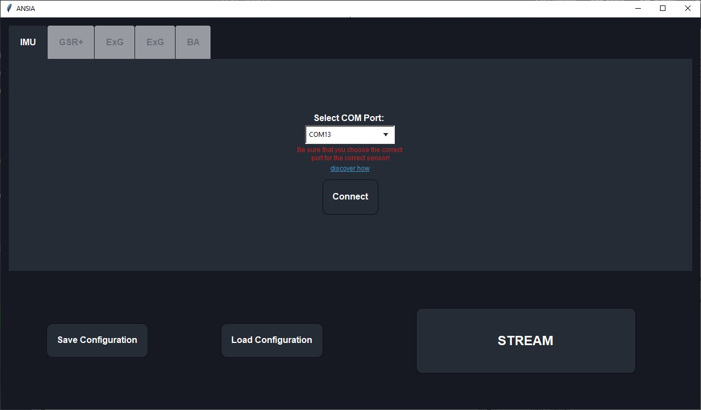
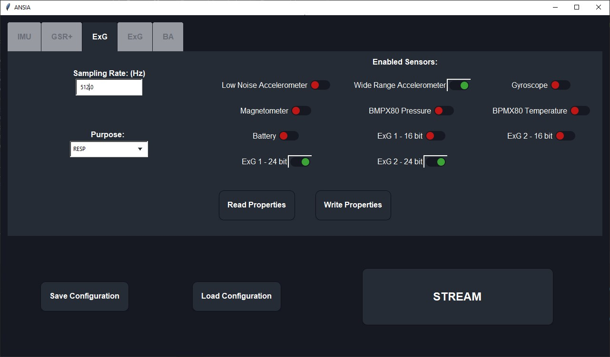

ANSIA provides an interface to the Consensys Bundle Development Kit, a bundle offered by the Shimmer3 sensing platform. The software can be launched in two different modes:

- Experimental mode: the user can save and visualize real-time data from Shimmer3 devices. Also, the user can customize the settings of the devices;
- WESAD mode: the user can use a real-time stress detector based on the physiological sequences of the Shimmer3 devices. In terms of Machine Learning, the detector is a Reservoir Computing Recurrent Neural Network. Also, a simple Stroop Test has been implemented.

